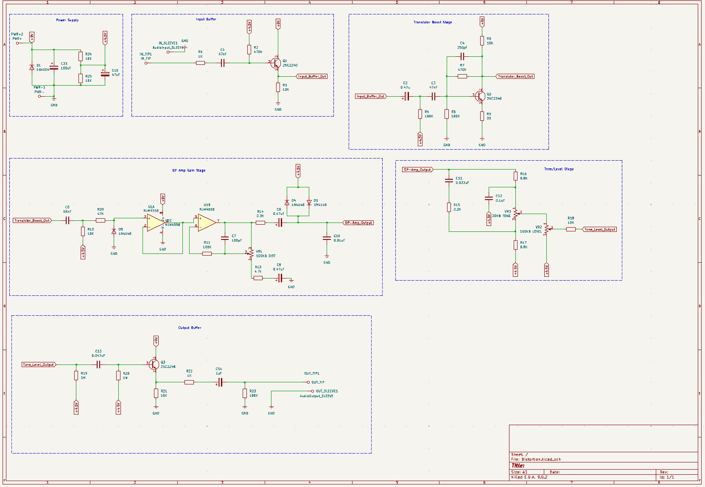
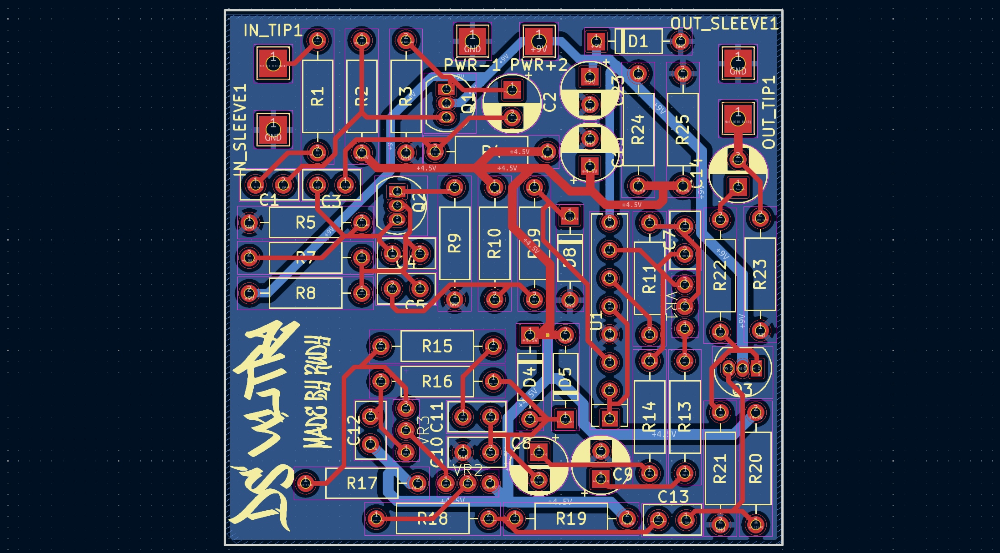

# DIY DS-1 Clone

This project is a custom-built clone of the iconic **BOSS DS-1 Distortion Pedal**, one of the most well-known and widely used distortion pedals in guitar history.

## Demo

## Why I Designed This?
BOSS has transitioned all of their modern DS-1 production to surface mount componenets (SMD), which makes the newer pedals:
- Much harder to mod or repair
- Difficult for beginners to understand or reverse-engineering
- Less accesible for DIYers who prefer trhough-hole componenets

## Features
- Uses the simplified DS-1 schematic from Electrosmash
- All through-hole componenets for easy assembly and modding
- Fits inside standard 125B Aluminium enclosure
- True-Bypass 

### Schematic V1

### PCB V1

### BOM

You can find the [BOM here](./BOM.md)

You can order the pcb using the gerbers inside `/src/fab`

Go to [build instructions](./Build_Instructions.md) to find out how to assemble one
